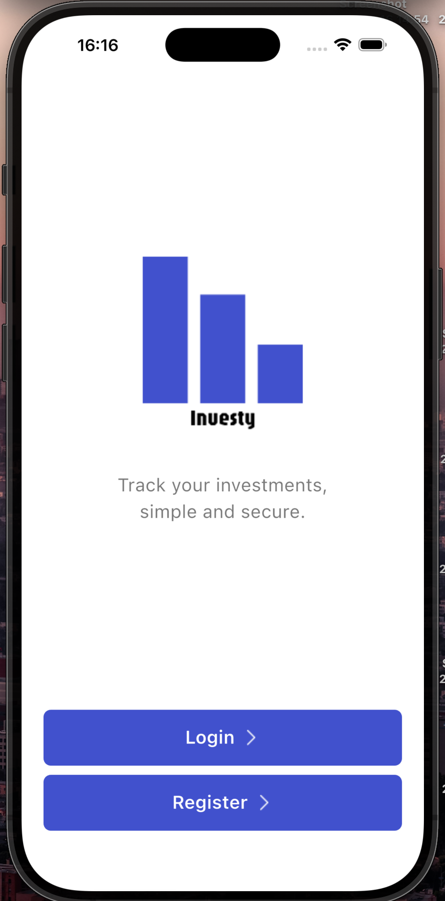
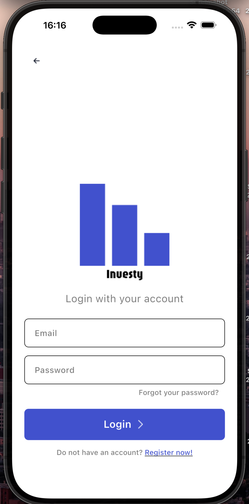
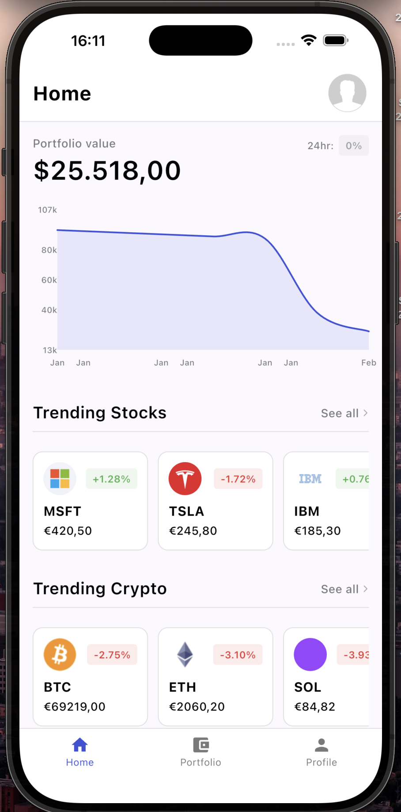
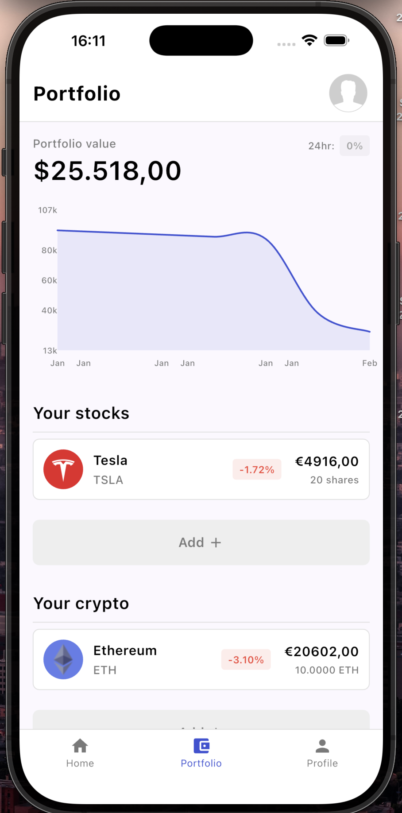
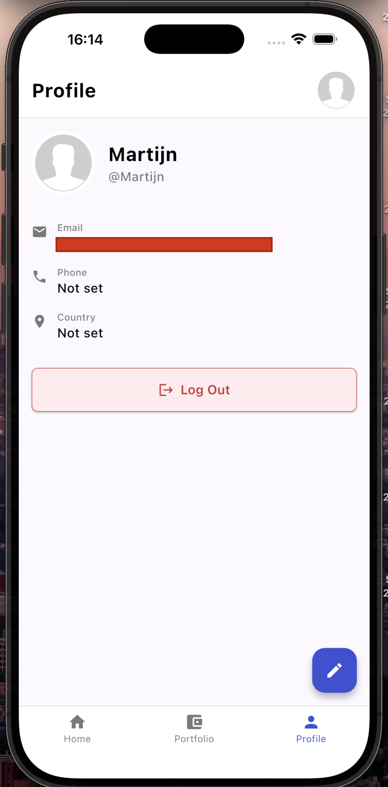
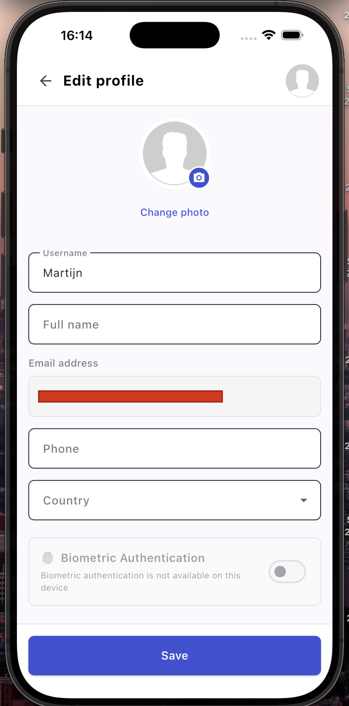

# Investy

**Track your investments — simple and secure.**

Investy is a Flutter mobile app for tracking stocks and cryptocurrency in a single portfolio.  
The app focuses on clean UI, secure authentication, and persistent user data with live crypto prices.

---

## Overview

Investy allows users to manage a personal investment portfolio and monitor its performance over time.  
The app is built with Flutter for iOS and Android and uses Firebase for authentication and data persistence.

Key goals:
- Simple UI
- Secure user sign-in
- Persistent portfolio and profile data
- Clear insight into portfolio value and trends

---

## Features

### 📊 Portfolio tracking
- Add and track cryptocurrency and a predefined set of stocks
- View total portfolio value and 24h change
- Swipe to remove holdings
- Portfolio data persisted per user in Firestore

### 📈 Value history
- Daily portfolio value snapshots stored in Firestore
- Minimal line chart showing historical value (e.g. last 30 days)

### 🔥 Trending assets
- Browse trending stocks and cryptocurrencies
- Live prices and percentage changes
- Crypto market data powered by CoinGecko

### 🔐 Authentication & security
- Email/password sign up and login (Firebase Authentication)
- Password reset flow
- Optional biometric lock (Face ID / Touch ID) when reopening the app

### 👤 Profile & settings
- View and edit profile information (username, full name, email, phone, country)
- Enable or disable biometric authentication
- Secure logout

---

## Screenshots

| | |
|---|---|
| **Auth** – Landing screen with login/register | **Login** – Email/password with reset option |
|  |  |
| **Home** – Portfolio value, chart, trending assets | **Portfolio** – Holdings overview and asset management |
|  |  |
| **Profile** – User info and logout | **Edit profile** – Details and biometric toggle |
|  |  |

---

## Tech stack

- **Flutter (Dart)** – Cross-platform mobile development (iOS & Android)
- **Firebase**
  - Authentication (email/password, password reset)
  - Firestore (portfolio data, user profile, daily value snapshots)
- **CoinGecko API** – Live cryptocurrency prices and metadata
- **State management** – Provider
- **Charts** – fl_chart
- **Environment variables** – ENVied (build-time `.env`, no secrets in repo)
- **Biometrics** – local_auth

---

## Running the project locally

Requires the Flutter SDK. After cloning, run `flutter pub get` before the steps below (and before running build_runner if you set up the API key).

### 1. Flutter

```bash
flutter doctor
```

### 2. CoinGecko API key

The app requires a CoinGecko API key for live crypto data. Get a free key at [CoinGecko API](https://www.coingecko.com/en/api).

1. Copy `.env.example` to `.env`
2. Add:
   ```env
   COINGECKO_API_KEY=your_api_key
   ```
3. Generate env files:

   ```bash
   dart run build_runner build --delete-conflicting-outputs
   ```

   Do not commit `.env`. If you add a real API key and regenerate `lib/env/env.g.dart`, do not commit that file.

### 3. Firebase

- `lib/firebase_options.dart` is gitignored
- Configure Firebase:

  ```bash
  flutterfire configure
  ```

### 4. Install dependencies & run

```bash
flutter pub get
flutter run
```

---

## Project structure (high level)

```text
lib/
├── config/        # App & API configuration
├── datamodel/     # Models (assets, portfolio, user, value snapshots)
├── env/           # ENVied environment setup
├── repository/    # Data sources (Firestore, CoinGecko, assets)
├── services/      # Auth, biometrics, external APIs
├── viewmodel/     # State management (Provider)
└── widgets/       # Screens and shared UI components
```

---

## Notes

- Stock support is intentionally limited to a predefined set to keep the focus on UX and core flows.
- This project is intended as a portfolio showcase demonstrating mobile UI, state management, authentication, and data persistence.

---

## License

Private / portfolio project.  
Not intended for commercial redistribution.